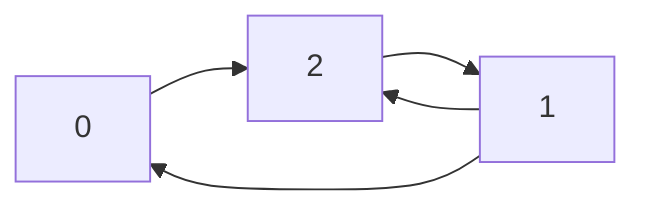
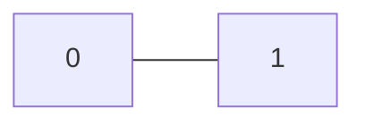
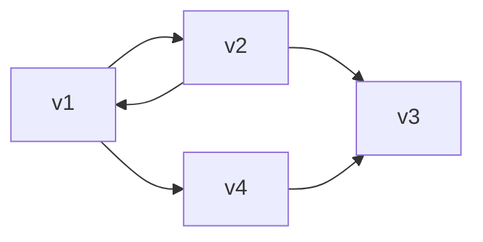
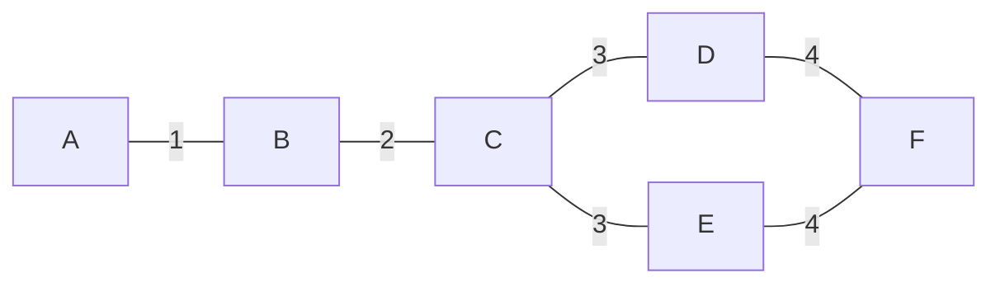
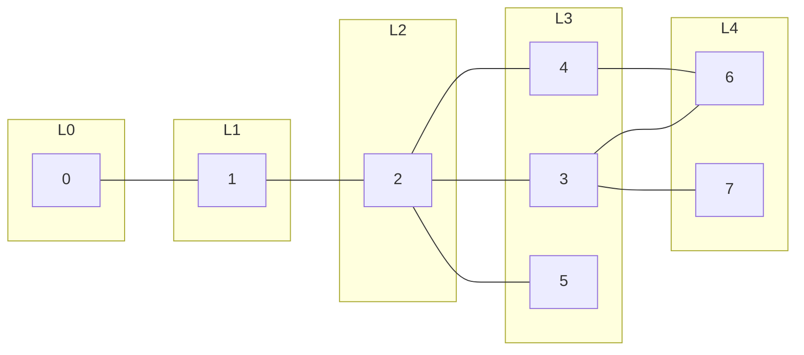
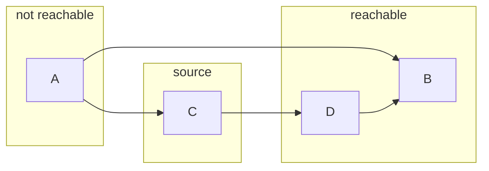
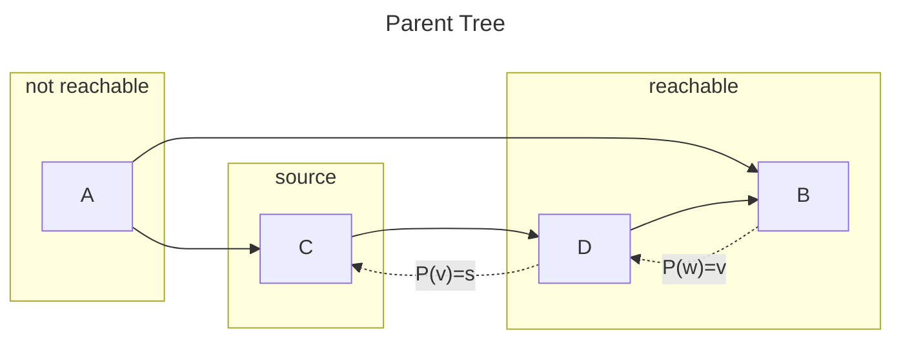
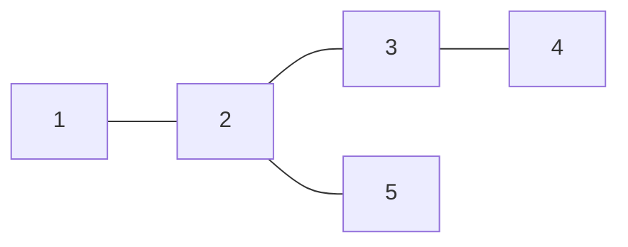

# Coding
## Big O
* A Language and metric that we use to describe the efficiency of algorithms
* Best Case, Worst Case, Expected Case
* Time Complexity
* **Space Complexity**
    * Memory or Space required by an algorithm
    * e.g., an array of size $n$ = $O(n)$ space
    * e.g., an two dimensional array of size $n*n$ = $O(n^2)$ space
    * The term Space Complexity is misused for Auxiliary Space at many places. Following are the correct definitions of Auxiliary Space and Space Complexity. 
    * **Auxiliary Space** is the extra space or temporary space used by an algorithm.
* Drop the Constants
    * $O(2n)$ = $O(n)$
* Drop  the  Non-Dominant Terms
    * $O(N^2 + N)$ = $O(N^z)$
    * $O(N + log N)$ = $O(M)$
    * $(5*2^N + ie00N^{100})$ = $O(2^N)$
* Big O Chart
    * $O(1)$ - Excellent/Best
    * $O(log n)$ - Good
    * $O(n)$ - Fair
    * $O(n log n)$ - Bad
    * $O(n^2)$, $O(2^n)$ and $O(n!)$ - Horrible/Worst
* Multi-Part Algorithms: Add vs. Multiply
* Amortized Time
    * ArrayList

## Arrays
* An Array is a data structure consisting of a collection of elements, of same memory size, each identified by at least one array index or key.
* We can get size, capacity, is_empty, element at a specific index, push, etc
* Time
    * In an array, ‘ARR’ where the address of the first element is ‘A’ and the size of each element is ‘S’, ‘i’th element can be defined as 
    * $ARR[i] = A + (i - 1) * S$
    * Thus accessing an element at a specific memory address takes O(1) time, as its relative address can be calculated in constant time.
    * Similarly editing any element of the array takes O(1) time.
    * Inserting a new element at a particular index in arrays is only possible when we skip all the elements before that index, which takes O(N) time.
    * Similarly, deletion operation also takes O(N) time.
    * Searching operation in arrays takes O(N) time without any specific algorithm as we need to iterate and check every element in the array.
* Space
    * Contiguous in memory, proximity helps performance
    * Space needed = (array capacity, which is >= n) * size of each item, but even if $2n$, still $O(n)$

## Linked Lists
* A Linked List is a data structure for storing objects in linear order
* A linked list is a linear data structure, in which the elements are not stored at contiguous memory locations. The elements in a linked list are linked using pointers.
### Characteristics
* In most cases, it has head pointer and tail pointer
* It store data `Null` if it's the end of LinkedList
### Operations
* Insert
* Delete
* Search
### Types
* Singly Linked List
* Doubly Linked List
* Circular linked List
### Singly Linked List
* a pointer that points the first node
* value
* next node pointer
#### Operations
* Access
    * Worst Case: $O(n)$
* Insert
    * Worst Case: $O(n)$
* Delete
    * Worst Case: $O(n)$
* Search
    * Worst Case: $O(n)$
### Doubly Linked List
#### Architecture
* a pointer that points the first node
* previous node pointer
* value
* next node pointer
#### Operations
* Access
    * Worst Case: $O(n)$
* Insert
    * Worst Case: $O(1)$
* Delete
    * Worst Case: $O(n)$
* Search
    * Worst Case: $O(n)$
### Linked List vs Array
* Linked List doesn't need to resize unlike Array does
* Array has an random access capability unlike Linked List doesn't
* Search operation takes $O(n)$ for Singly Linked List unlike Array takes $O(1)$
* Linked List has in-contiguous memory allocation unlike Array has contiguous memory allocation

## Stacks
* A stack is an abstract data type that serves as a collection of elements
### Characteristics
* LIFO
* Can be implemented with LinkedList or Array
### Operations
* Push, which adds an element to the collection, and
* Pop, which removes the most recently added element that was not yet removed.
* Peek, which returns the value of the last element added.
### Time Complexity
1. Push: $O(1)$
2. Pop: $O(1)$
3. Peek: $O(1)$
4. Search: $O(n)$
5. Size: $O(1)$
### Space Complexity
* In most cases, $O(n)$


## Queue
* A Queue is defined as a linear data structure that is open at both ends and the operations are performed in First In First Out (FIFO) order.
### Operations
* Enqueue, which adds an element to the rear of the queue
* Dequeue, which removes an element from the front
### Time Complexity
* Enqueue: O(1)
* Dequeue: O(1)
* Since in most cases a queue can be implemented using Arrays or Linked Lists.
### Space Complexity
* Enqueue: O(1) (Auxiliary Complexity)
* Dequeue: O(1) (Auxiliary Complexity)

## Hash Table
* Hash Table is a data structure stores elements in key-value pairs where
* key: unique integer that is used for indexing the values
* value: data that are assoicated with keys
### Dictionary
* A generic way to map keys to values
### Hash Table 
* An implementation of a dictionary using a hash function
### Hashing
* Hashing is a technique of mapping a large set of arbitrary data to tabular indexes using a hash function. It is a method for representing dictionaries for large datasets.
* It allows lookups, updating and retrieval operation to occur in a constant time i.e. $O(1)$
### Hash Collision
* Hash Collision is a conflict that occurs when a hash function generates the same index for multiple keys
* Can be resolved by:
    * Collision resolution by chaining
    * Open Addressing: Linear/Quadratic Probing and Double Hashing
### Direct-access tables
* U = universe of keys (e.g., 0, 1, 2, 3, 4, ...)
* K = actual keys (e.g., 4, 5, ...)
### Operations
### Time Complexity
* Insert: average $O(1)$, worst $O(n)$
* Delete: average $O(1)$, worst $O(n)$
* Search: average $O(1)$, worst $O(n)$

## Binary Search 
Binary search is a search algorithm that is used to quickly find a value in a sorted sequence with each iteration of the algorithm half of the remaining values
### Pseudo Code 
* Case 1: The element that you are searching is not in the target space - Return `-1`
    * max < min
* Case 2: The element that you are searching is in the target space
    * Set min = 0 and max n - 1
    * Guess the `arr[mid]`
    * if `arr[mid]` < `target`, then `min` = `mid + 1`
    * else-if `target` < `arr[mid]`, then `max` = `mid - 1`
    * else `arr[mid]` == `target`, return the mid
### Time Complexity
* $Log_2(N)$ 

## Bitwise operations
### Operators
* `&, |, ^, ~, >>, <<`
### Manipulation
* Bit manipulation is the act of algorithmically manipulating bits or other pieces of data shorter than a word. 
* In computing, a `word` is the natural unit of data used by a particular processor design. A word is a fixed-sized datum handled as a unit by the instruction set or the hardware of the processor. The number of bits or digits in a word (the word size, word width, or word length) is an important characteristic of any specific processor design or computer architecture.
* Set Bit
    ```python
    def set_bit(x, position):
        mask = 1 << position
        return x | mask
    ```
* Clear Bit
    ```python
    def clear_bit(x, position):
        mask = 1 << position
        return x & ~ mask
    ```
* Flip Bit
    ```python
    def flip_bit(x, position):
        mask = 1 << position
        return x ^ mask
    ```
* Is Bit Set
    ```python
    def is_bit_set(x, position):
        shifted = x >> position
        return shifted & 1
    ```
* Modify Bit (Clear)
    ```python
    def modify_bit(x, position, state):
        mask = 1 << position
        return (x & ~mask) | (-state & mask)
    ```
### Bit Tricks
* Check If Even
    ```python
    def is_even(x):
        return (x & 1) == 0
    ```
    ```python
    def is_even(x):
        return ~(x & 1)
    ```
* Check if power of two
    ```python
    def is_power_of_two(x):
        return (x & x - 1) == 0
    ```
    ```python
    def is_power_of_two(x):
        return ~(x & x - 1)
    ```
### 1's Complement
* The ones' complement of a binary number is the value obtained by inverting (flipping) all the bits in the binary representation of the number
### 2's Complement
* Two's complement is a mathematical operation to reversibly convert a positive binary number into a negative binary number with equivalent negative value, using the binary digit with the greatest place value as the sign to indicate whether the binary number is positive or negative. 
#### Solve
* -0 and +0

## Trees
### Definition
* Tree data structure is a hierarchical structure that is used to represent and organize data in a way that easy to navigate and search
* It is a collection of nodes that are connected by edges and has a hierarchical relationship between the nodes.
* Root is the topmost node. and nodes below it are called child nodes.
* Each node can have multiple child nodes, and these child nodes can also have their own child nodes, forming a recursive structure.  
### Traversal
#### BFS (Breadth-first Search)
* Breadth-first Search is an algorithm for searching a tree data structure for a node that satisfies the given property.
* It starts at the tree root and explorers all nodes at the present depth prior to moving on to the next depth level of nodes. 
* All connections at one time
* Level order (using Queue)
* Time complexity: $O(n)$
* Space complexity: best: $O(1)$ worst: $O(n/2) = O(n)$
#### DFS (Depth-first Search)
* Depth-first Search is an algorithm for traversing or searching tree or graph data structures.
* The algorithm starts at the root of node and explores as far as possible along each branch before backtracking.
* time complexity: $O(n)$
* space complexity: best $O(log n) = height of the tree$ / worst $O(n)$ 
* In-order: L - Root - R
* Pre-order: Root - L - R
* Post-order: L - R - Root

## Binary Search tree
*  Binary Search tree, also known as an ordered or sorted binary tree, is rooted rooted binary tree data structure with the key of each internal node being greater than all the respective node's left subtree and less than the ones its right sub tree.
### Search
* Compare the given value, if it's less than the key, go left. If it's greater than the key, go right.
* If a node is a leaf (has no children), you can insert the given node to the node.
* Time Complexity: $O(log n) = height of the tree$
### Insert
* Compare the given value, if it's less than the key, go left. If it's greater than the key, go right.
* If the leaf node, insert the target based on the same criteria.
### Delete
1. The given node is a leaf node, the node will be replaced by `nil`
2. The given node has one child, the node will be replaced by `nil` and the node's child will take over the node's position
3. The given node has two children, you'll find the key value that is bigger than the target but the smallest in the right subtree of the node and replace the target node and the smallest node.
### Travesal
1. Pre-order
2. In-order
3. Post-order
### Discussion
1. Runtime
   1. Search - best: $O(log n)$ / worst: $O(n)$ - consequent order
   2. Insert - best: $O(log n)$ / worst: $O(n)$ - consequent order
   3. Delete - best: $O(log n)$ / worst: $O(n)$ - consequent order
2. Duplicate value?
   1. It's up to your choice. In most cases, best practice will be in the right leaf because it makes more sense when we traverse it in-order.
### Find the Maximum Depth or Height of given Binary Tree
1. The height of an empty tree is `0`.
2. Use DFS
   1. Recursively calculate the height of the left and the right subtrees of a node and assign height to the node as max of the heights of two children + 1.
   2. Time complexity: $O(n)$
   3. Auxiliary Space: $O(n)$ due to recursive stack 
3. Use BFS
   1. Use Queue.
      1. Traverse the tree in level order traversal starting from root
      2. Run a while loop till Q is not empty 
         1. Store the front element of Q and Pop out the front element
         2. If the front of Q is `NULL` then incremenet depth by one and if queue is not empty then push NULL into the Q.
         3. Else if the element is not `NULL` then check for its left and right children and if they are not NULL push them into Q.
      3. Return depth
   2. Time Complexity: $O(n)$
   3. Auxiliary Space: $O(n)$

## Heap
* A tree-based data structure, complete binary tree, and min/max heap property. (we can have `n'ary` heap as well)
* A Heap is a specialized tree-based data structure that satisfies the heap property:
    * In a `max heap`, for any given node C, if P is a parent node of C, then the key (the value) of P is greater than or eqaul to the key of C.
    * In a `min heap`, the key of P is less than or equal to the key of C.
    * The node at the top of the heap with no parent node is called the root node
* Often interchangably used with Priority Queue
* In a heap, the highest priority element is always stored at the root.
* However, a heap is not a sorted structure; it can be regarded as a partially ordered. A heap is a useful data structure when it is necessary to repeatedly remove the object with the the highest or lowest priority, or when insertions need to be interspersed with removals of the root node.

### Binary Trees
* A binary tree is a tree data structure in which each node has at most two children, which are referred to as the left child and the right child.
#### Types
* A `rooted` binary tree has a root node and every node has at most two children
* A `full` (`proper` or `plane` or `strict`) binary tree is a tree in which every node has **either 0 or 2 children**
    * A single vertex (a single node as a root node)
    * A tree whose root node has two subtrees, both of which are full binary trees
* A `complete` binary tree is a binary tree in which **every level, except possibly the last, is completely filled**, and all nodes in the last level are as far left as possible.
    * A `perfect` binary tree is a binary tree in which all interior nodes have **two children and all leaves have the same depth or same level**.
    * A `almost complete` binary tree: 
        * Leaves should be present only at the last and 2nd last level
        * Leaves should be filled from left to right in the same level
* A `balanced` binary tree is a binary tree structure in which the left and right subtrees of **every node differ in height by no more than 1** (the number of edges from the top-most node to the farthest node in a subtree).
* A `degenerate` (or `pathological`) tree is where each parent node has only one associated child node.

### Find the Maximum Depth or Height of given Binary Tree
1. The height of an empty tree is `0`.
2. Use DFS
   1. Recursively calculate the height of the left and the right subtrees of a node and assign height to the node as max of the heights of two children + 1.
   2. Time complexity: $O(n)$
   3. Auxiliary Space: $O(n)$ due to recursive stack 
3. Use BFS
   1. Use Queue.
      1. Traverse the tree in level order traversal starting from root
      2. Run a while loop till Q is not empty 
         1. Store the front element of Q and Pop out the front element
         2. If the front of Q is `NULL` then incremenet depth by one and if queue is not empty then push NULL into the Q.
         3. Else if the element is not `NULL` then check for its left and right children and if they are not NULL push them into Q.
      3. Return depth
   2. Time Complexity: $O(n)$
   3. Auxiliary Space: $O(n)$

### Operations
#### Basic
* `find-max`/`find-min` (= `peek`): find a maximum item of a max-heap, or minimum item of a min-heap, respectively
* `insert` (= `push`): adding a new key to the heap
    1. Add the node as a leaf node to the bottom of the tree
    2. HeapifyUp: bubble sort the heap until the heap meets the heap min/max property
* `extract-max`/`extract-min` (= pop): returns the node of maximum value from a max heap [or minimum value from a min heap] after removing it from the heap
    1. Remove the max/min value (root node) from the heap
    2. Make the most recent added node to the root node
    3. HeapifyDown: bubble sort the items until the heap meets the heap min/max property
* `delete-max`/`delete-min`: removing the root node of a max heap (or min heap), respectively
    1. Same process with the
* `replace`: pop root and push a new key. More efficient than pop followed by push, since only need to balance once, not twice, and appropriate for fixed-size heaps
#### Creation
* `create-heap`: create an empty heap
* `heapify`: create a heap out of given array of elements
* `merge` (`union`): joining two heaps to form a valid new heap containing all the elements of both, preserving the original heaps.
* `meld`: joining tow heaps to form a valid new heap containing all the elements of both, destroying the original heaps
#### Inspection
* `size`: return the number of items in the heap
* `is-empty`: return true if the heap is empty, false otherwise
#### Internal
* `increase-key` or `decrease-key`: updating a key within a max-heap or min-heap, respectively
* `delete`: delete an arbitary node (followed by moving last node and sifting to maintaining heap) 
* `sift-up` (`HeapifyUp`): move a node up in the tree, as long as needed; used to restore heap condition after insertion. Called `sift` because node moves up the tree until it reaches the correct level, as in a sieve.
* `sift-down` (`HeapifyDown`): move a node down in the treem, similar to sift-up; used to restore heap condition after deletion or replacement

### Types of Heap 
#### Max-heap
* `max-heap` is a complete binary tree in which root is always be maximum and it's applied to the sub trees as well.
#### Min-heap
* `min-heap` is a complete binary tree in which root is always be minimum and it's applied to the sub trees as well.

### Representation of Heap
#### Tree Conecepts
* A tree can be represented in the form of an array
* indices:
    * Parent: `i`
    * Left Child: $2*i + 1$
    * Right Child: $2*i + 2$
    * If child index is `i`, then parent index is $⌈ i / 2 ⌉ - 1$ or $ceil(i / 2) - 1$
        * `t = [1, 3, 5, 6, 7]`
            ```bash
            1
            ├── 3
            │   ├── 6
            │   └── 7
            └── 5
            ```
        * e.g., `t[3] = 6`, parent = $⌈ 3 / 2 ⌉ - 1 = ceil(3 / 2) - 1 = 2 - 1 = 1$ `t[1] = 3`
##### Height
* number of elements = `N`
* height = `h` = $⌊log_2 N⌋ = floor(log_2 N)$
    | N                | 1   | 2   | 3    | 4   | 5    | ... |
    | ---------------- | --- | --- | ---- | --- | ---- | --- |
    | h (=$⌊log_2 N⌋$) | 0   | 1   | 1    | 2   | 2    | ... |
    | $log_2 N$        | 0   | 1   | 1.58 | 2   | 2.23 | ... |
* the max number of nodes at height `h` = $2 ^ h$
* the max number of nodes in the entire tree = $2^{h + 1} - 1$
    * $\sum_{n=0}^{n} 2^n$
    * $2S_n - S_n = S_n = 2^{h + 1} - 1$
##### The Max Array size for heap
* Let `h` is the height of the tree, then $2^{h + 1} - 1$ will be the max size of array.
##### Range
* In a complete binary tree, Range of leaves = $⌊N / 2⌋ = floor(N / 2) + 1$ to $N - 1$ (0-based)
    * `t = [1, 2, 3, 9, 5, 6, 7]`
        ```bash
        1
        ├── 2
        │   ├── 9
        │   └── 5
        └── 3
            ├── 6
            └── 7
        ```
        * e.g., leaves `[9, 5, 6, 7]`
            * indices: $⌊N / 2⌋ = ⌊7 / 2⌋ = 3$ to $6$

### Heapify Algorithm | Max Heapify | Min Heapify
#### Max-Heapify/Min-Heapify
1. Concepts
    * If heapsize = $N$, the range of leaves = $⌊N / 2⌋$ to $N - 1$ (0-based)
    * Range of internal nodes, $0$ to $⌊N / 2⌋ - 1$
2. Heap Property
    * Max-heap/Min-heap root node should be greater/less than all left and right subtree nodes and it is recursively true for all subtrees 
    * A leaf node always follow the max/min heap property.
3. Heapify
    * Heapify is a process of creating/rearranging a heap data structure by comparing each parent with its children **recursively** from a complete binary tree
    * e.g., Convert the given binary tree to max-heap
        ```bash
        1
        ├── 14
        │   ├── 8
        │   │   ├── 2
        │   │   └── 4
        │   └── 7
        │       └── 6
        └── 10
            ├── 9
            └── 3
        ```
        1. Stop condition
            * Reach leaf node
            * Root > L && Root > R
        2. `Node 1`
            * is not leaf node
            * `Root > L && Root > R` is not true
            * Left subtree is already a heap and Right subtree is already a heap
            * Take the `max` element from Left node or Right node
            * `Node 1` and `Node 14` will be swapped
                ```bash
                14
                ├── 1
                │   ├── 8
                │   │   ├── 2
                │   │   └── 4
                │   └── 7
                │       └── 6
                └── 10
                    ├── 9
                    └── 3
                ```
        3. `Node 1`
            * is not leaf node
            * `Root > L && Root > R` is not true
            * Take the `max` element from Left node or Right node
            * `Node 1` and `Node 8` will be swapped
                ```bash
                14
                ├── 8
                │   ├── 1
                │   │   ├── 2
                │   │   └── 4
                │   └── 7
                │       └── 6
                └── 10
                    └── 9
                    └── 3
                ```
        4. `Node 1`
            * is not leaf node
            * `Root > L && Root > R` is not true
            * Take the `max` element from Left node or Right node
            * `Node 1` and `Node 4` will be swapped
                ```bash
                14
                ├── 8
                │   ├── 4
                │   │   ├── 2
                │   │   └── 1
                │   └── 7
                │       └── 6
                └── 10
                    └── 9
                    └── 3
                ```
        5. `Node 1`
            * is a leaf node
            * Stop
4. Time Complexity: $O(log N)$
5. Space Complexity: $O(log N)$

### Build Heap Algorithm
#### Important Notes
* If you want to apply Heapify algorithm to $i^{th}$ node, **both the left subtree and the right subtree of the node should already be a heap.**
#### Build Max/Min Heap
* Build max-heap from the given array
    * `a = [3, 6, 5, 0, 8, 2, 1, 9]`
    * Leaf nodes: $floor(N/2)$ to $N - 1$ / 4 to 7  
    * Internal node: $0$ to $floor(N/2) - 1$ / 0 to 3
* Heapify the last internal node first, because their left and right subtree should follow heap property first and then heapify parent internal nodes. (Bottom up)
* `a = [3, 6, 5, 0, 8, 2, 1, 9]`
    ```markdown
           3     
          / \    
        6     5  
       / \   / \ 
      0   8 2   1
     /           
    9
    ```
    * Internal nodes: [0] to [3] (`[3, 6, 5, 0]`)
    * Leaf nodes: [4] to [7] (`[8, 2, 1, 0]`)
1. Starts with the Last internal node `0`
    * To make left subtree of `Node 0` into a max-heap, swap `Node 0` and `Node 9`
        ```markdown
               3     
              / \    
            6     5  
           / \   / \ 
          9   8 2   1
         /           
        0
        ```
2. $2^{nd}$ last internal node `5`
    * Both subtrees of `Node 5` are already heaps
        ```markdown
               3     
              / \    
            6     5  
           / \   / \ 
          9   8 2   1
         /           
        0
        ```
3. the next last internal node `6`
    * Left subtrees of `Node 6` is not a heap. So we take the max value between 9 and 8. Swap it with 6.
    * Check the swap value 6 and 0 (previously done), but it's already a max heap.
        ```markdown
               3     
              / \    
            9     5  
           / \   / \ 
          6   8 2   1
         /           
        0
        ```
4. the next last internal node `3`
    * 3 < 9, so we swap 3 and 9
        ```markdown
               9     
              / \    
            3     5  
           / \   / \ 
          6   8 2   1
         /           
        0
        ```
    * Check the swapped value is in the correct place.
    * Take the max value between left node and right node and swap it. 3<=>8
        ```markdown
               9     
              / \    
            8     5  
           / \   / \ 
          6   3 2   1
         /           
        0
        ```
5. Done
##### Time complexity
* Bottom-up heapify has a time complexity of $O(N)$, while top-down heapify has a time complexity of $O(log N)$. Bottom-up heapify is typically faster for large heaps, while top-down heapify is faster for small heaps
* Rewatch https://youtu.be/VkKmmwzfIG4
##### Space Complexity
* $I(log N)$

### Heap Algorithms | Extract Max | Increase Key | Decrease Key | Insert Element
#### Extract Max
1. Save max value
2. Copy last element to root
3. Remove the old root and decrease the heap size
4. Heapify the new root
* Example 
    * `a = [9,8,7,5,4,3,2]`
        ```markdown
           9   
          / \  
         8   7 
        / \ / \
        5 4 3 2
        ```
    * Return 9 and make last node to the new root
        ```markdown
           2   
          / \  
         8   7 
        / \ /
        5 4 3
        ```
    * Heapify
        ```markdown
           8   
          / \  
         2   7 
        / \ /
        5 4 3
        ```
        ```markdown
           8   
          / \  
         5   7 
        / \ /
        2 4 3
        ```
5. Time complexity: $O(log N)$ - Max Heapify
6. Space Complexity: $O(log N)$ - Max Heapify
#### Increase Key
```markdown
     9   
    / \  
  8     7 
 / \   / \
6   5 4   3
```
1. Update Node value
    ```markdown
          9   
        /   \  
      8      7 
     / \    / \
    6   50 4   3
    ```
2. Up-heapify (assuming a max heap) to restore the heap property
    1. Parent > current node
    2. or
    3. Current node becomes the root of the tree
    ```markdown
         50   
       /   \  
      9     7 
     / \   / \
    6   8 4   3
    ```
3. Time Complexity: $O(log N)$ - Heapify
4. Space Complexity: $O(1)$ - Using array 
#### Decrease Key
```markdown
         9   
        / \  
      8     7 
     / \   / \
    6   5 4   3
   / \
  2   1
```
1. Decrease Node 8 to value 0 (Node can move only downward)
    ```markdown
             9   
            / \  
          0     7 
         / \   / \
        6   5 4   3
       / \
      2   1
    ```
2. Max-heapify current node
    ```markdown
             9   
            / \  
          6     7 
         / \   / \
        0   5 4   3
       / \
      2   1
    ```
    ```markdown
             9   
            / \  
          6     7 
         / \   / \
        2   5 4   3
       / \
      0   1
    ```
3. Time complexity: $O(log N)$
4. Space complexity: $O(log N)$
#### Insert Key
* In a complete binary tree, insert elements at last level from left to right
* Example
    ```markdown
             20   
            / \  
          9     8 
         / \   / \
        7   6 5   4
       /
      3   
    ```
1. Insert at the end of heap (Insert `12`)
    ```markdown
             20   
            / \  
          9     8 
         / \   / \
        7   6 5   4
       / \
      3   12
    ```
2. HeapifyUp(Percolation up)
    ```markdown
             20   
            / \  
          9     8 
         / \   / \
        12   6 5   4
       / \
      3   7
    ```
    ```markdown
             20   
            / \  
          12    8 
         / \   / \
        9   6 5   4
       / \
      3   7
    ```
3. Time complexity: $O(log N)$
4. Space complexity: $O(1)$ - applying while loop instead recursion
#### Heap Operations Time Complexity
1. find_max: $O(1)$
2. delete_max: $O(log N)$
3. insert: $O(log N)$
4. increase_key: $O(log N)$
5. decrease_key: $O(log N)$
6. find_min: $O(N)$
7. delete_random_element: $O(N)$
8. search_random_element: $O(N)$

### Heapsort Algorithm | CODE Implementation
#### Heapsort
* Heapsort = sorting using heap
* Algorithm used for heap sort
    * Extract Max/Min (Heapify Algo)
* Example
    * a = [9, 6, 8, 2, 1, 4, 3]
    ```markdown
         9   
        / \  
      6    8 
     / \   / \
    2   1 4   3
    ```
    1. ExtractMax
        1. Extract root / Return root
            ```markdown
                 null   
                / \  
              6    8 
             / \   / \
            2   1 4   3
            ```
            `return 9`
        2. Copy the last node to the new root / Heapsize decreased
            ```markdown
                 3
                / \  
              6    8 
             / \   /
            2   1 4  
            ```
        3. Max Heapify
            ```markdown
                 8
                / \  
              6    3 
             / \   /
            2   1 4  
            ```
            ```markdown
                 8
                / \  
              6    4 
             / \   /
            2   1 3  
            ```
* Time complexity: $O(n * log n)$ - Build heap $O(n)$ / $O(log N)$ for each the N Number of elements $O(N)$
#### Ref
https://www.youtube.com/playlist?list=PLEJXowNB4kPyP2PdMhOUlTY6GrRIITx28

### Priority Queue
* Priority Queue is nothing more than Abstract Data Type that meets:
    * Each element in a priority queue has na associated priority.
    * Elements with high priority are served before elements with low priority.
    * Duplicates:
        * In some implementations, if two elements have the same priority, they are served in the same order in which they were enqueued.
        * In other implementations, the order of elements with the same priority is undefined.
* Mostly implemented with heap

## Sorting
### Notes
#### Stability in sorting algorithms ("Is Quicksort stable?")
* Stable sort algorithms sort equal elements in the same order they appear in the input.
    * e.g., card deck / 7 - ♠ / 5 - ♥ / 2 - ♥ / 5 - ♠
        * Stable sort:
            * 7 - ♠ / 5 - ♥ / 5 - ♠ / 2 - ♥
        * Unstable sort:
            * 7 - ♠ / 5 - ♥ / 5 - ♠ / 2 - ♥
            * or
            * 7 - ♠ / 5 - ♠ / 5 - ♥ / 2 - ♥
* When equal elements are indistinguishable, such as with integers, or more generally, any data where the entire element is the key, stability is not an issue.
* Stability is also not an issue if all keys are different.
* For `heapsort`, see Heap data structure above. Heap sort is great, but not stable
##### Make unstable sorting algorithms stable
1. Artificially extend the key comparison
    1. e.g., Sort by both `Rank` and `Suit`
        * May require additional time and space
#### Merge Sort for Linked Lists
* Merge sort is often preferred for sorting a linked list. The slow random-access performance of a linked list makes some other algorithms (such as quicksort) perform poorly, and others (such as heapsort) completely impossible
##### Merge Sort
1. If the head is NULL or there is only one element in the Linked List, then return
2. Else divide the Linked List into two halves,
    * `FrontBackSplit(head, &a, &b); /* a and b are two halves */`
3. Sort the two halves a and b
    * `MergeSort(a);`
    * `MergeSort(b);`
4. Merge the sorted a and b, and update the head pointer using headRef
    * `*headRef = SortedMerge(a, b);`

### Merge Sort
#### Concept
1. Divide the unsorted list into `n` sublists, each containing one element (a list of one element is considered sorted)
2. Repeatedly merge sublists to produce new sorted sublists until there is only one sublist remaining. This will be the sorted list.
#### Example
`a = [3, 7, 8, 5, 4, 2, 6, 1]`
1. `mergeSort`
    ```bash
              [3, 7, 8, 5, 4, 2, 6, 1]
                       /   \
            [3, 7, 8, 5]   [4, 2, 6, 1]
                /  \           /  \
           [3, 7]  [8, 5] [4, 2]  [6, 1]
            / \     / \     / \      / \
          [3] [7] [8] [5] [4] [2]  [6] [1]
    ```
2. `merge` - merging unit length cells into sorted subarrays
    ```bash
    [3] [7]  [8] [5]  [4] [2]  [6] [1]
      \ /      \ /      \ /      \ /
    [3, 7]   [5, 8]   [2, 4]   [1, 6]
         \   /             \   /
      [3, 5, 7, 8]       [1, 2, 4, 6]
                  \     /
        [1, 2, 3, 4, 5, 6, 7, 8]
    ```
#### Time Complexity
* Given the `n` number of objects,
    * Average: $O(n log n)$
    * Worst case: $O(n log n)$
#### Space Complexity
* Auxiliary space: $O(n)$


### Quick Sort
* Quicksort is an efficient, general-purpose sorting algorithm.
* Quicksort is a divide-and-conquer algorithm
#### How does QuickSort work?
* The key process in quickSort is a `partition()`. The target of partitions is to place the pivot (any element can be chosen to be a pivot) at its correct position in the sorted array and put all smaller elements to the left of the pivot, and all greater elements to the right of the pivot.
* `Partition` is done recursively on each side of the pivot after the pivot is placed in its correct position and this finally sorts the array
##### Choice of Pivot:
* Always pick the first element as a pivot
* Always pick the last element as a pivot
* Pick a random element as a pivot
* Pick the middle as the pivot (ideal)
##### Partition Algorithm
* The logic is simple, we start from the leftmost element and keep track of the index of smaller (or equal) elements as `i`. While traversing, if we find a smaller element, we swap the current element with `arr[i]`. Otherwise, we ignore the current element.
#### Example
* **The pivot element is compared to all of the items** starting with the first index. If the element is greater than the pivot element, a second pointer is appended
* When compared to other elements, **if a smaller element than the pivot element is found, the smaller element is swapped with the larger element identified before.**
`a = [8, 7, 6, 1, 0, 9, 2]`
1. Select the Pivot Element
    * `pivot = 2`
2. Rearrange the Array
    1. A pointer is fixed at the pivot element. The pivot element is compared with the elements beginning from the first index.
        ```bash
        8   7   6   1   0   9   2
                                ↑
                                pp
        ```
    2. If the element is greater than the pivot element, a second pointer is set for that element.
        ```bash
        8   7   6   1   0   9   2
        ↑                       ↑
        p2                      pp
        ```
        * `8 > 2`
    3. Now, pivot is compared with other elements. If an element smaller than the pivot element is reached, the smaller element is swapped with the greater element found earlier.
        ```bash
        8   7   6   1   0   9   2
        ↑   ↑                   ↑
        p2  i                   pp
        ```
        ```bash
        8   7   6   1   0   9   2
        ↑       ↑               ↑
        p2      i               pp
        ```
        ```bash
        8   7   6   1   0   9   2
        ↑           ↑           ↑
        p2          i           pp
        ```
        ```bash
        1   7   6   8   0   9   2
                                ↑
                                pp
        ```
        * `1` is swapped with the `8` since `1 < 2`
    4. Again, the process is repeated to set the next greater element as the second pointer. And, swap it with another smaller element.
        ```bash
        1   7   6   8   0   9   2
            ↑                   ↑
            p2                  pp
        ```
        ```bash
        1   7   6   8   0   9   2
            ↑                   ↑
            p2                  pp
        ```
        ```bash
        1   7   6   8   0   9   2
            ↑   ↑               ↑
            p2  i               pp
        ```
        ```bash
        1   7   6   8   0   9   2
            ↑       ↑           ↑
            p2      i           pp
        ```
        ```bash
        1   7   6   8   0   9   2
            ↑           ↑       ↑
            p2          i       pp
        ```
        ```bash
        1   0   6   8   7   9   2
                                ↑
                                pp
        ```
        * `0` is swapped with the `7` since `0 < 2`
    5. The process goes on until the second last element is reached.
        ```bash
        1   0   6   8   7   9   2
                ↑               ↑
                p2              pp
        ```
        ```bash
        1   0   6   8   7   9   2
                ↑           ↑   ↑
                p2          i   pp
        ```
        * No swap since 8, 7, 9 are all greater than pivot 2
        * And reached the last element
    6. Finally, the pivot element is swapped with the second pointer.
        ```bash
        1   0   6   8   7   9   2
                ↑               ↑
                p2              pp
        ```
        ```bash
        1   0   2   8   7   9   6
                ↑               
                pp              
        ```
3. Divide Subarrays
    * Pivot elements are again chosen for the left and the right sub-parts separately. And, **step 2** is repeated.
        * left
            ```bash
            1   0              
            ```
        * right
            ```bash
            2   8   7   9   6
                            ↑               
                            pp              
            ```
            ```bash
            8   7   9   6
                        ↑               
                        pp              
            ```
            ```bash
            6   7   9   8
            ↑           
            pp            
            ```
            * right 
                ```bash
                7   9   8
                        ↑
                        pp
                ```
                * Last elmeent swaps with pivot since reached the last element
                ```bash
                7   8   9
                    ↑    
                    pp    
                ```
                * left
                    ```bash
                    7
                    ```
                * right
                    ```bash
                    9
                    ```
4. Result
    ```bash
    0   1   2   6   7   8   9
    ```
#### Time complexity
* Worst Case: $O(n^2)$
    * It occurs when the pivot element picked is either the greatest or the smallest element.
    * This condition leads to the case in which the pivot element lies in an extreme end of the sorted array. One sub-array is always empty and another sub-array contains n - 1 elements. Thus, quicksort is called only on this sub-array.
    * However, the quicksort algorithm has better performance for scattered pivots.
* Best Case: $O(n log n)$
    * It occurs when the pivot element is always the middle element or near to the middle element.
* Average Case: $O(n log n)$
    * It occurs when the above conditions do not occur.
#### Space Complexity
* $O(log n)$

### General about Sorting
#### Insertion Sort
* Time Complexity: $O(n^2)$
* Invariant: S is sorted
* Start with empty list `S` & unsorted list `I` of n items
* pseudocode
    ```bash
    for(each item * in I) {
        insert * into S, in sorted order
    }
    ```
* If `S` is linked list, $O(n)$ worst-case time to find right position
* If `S` is array, $O(n)$ worst-case time to shift higher items over
* If `S` is array, insertion sort is in-place.
    * Example
        * `I = [7, 3, 9, 5]`
            ```bash
            7   3   9   5
            └─────I─────┘
            ```
            ```bash
             7   3   9   5
            └S┘  └───I───┘
            ```
            ```bash
            3   7   9   5
            └─S─┘   └─I─┘
            ```
            ```bash
            3   7   9   5
            └───S───┘ └─I─┘
            ```
            ```bash
            3   5   7   9
            └─────S─────┘
            ```
* If `S` is a balanced search tree, running time $O(nlogn)$
#### Selection Sort
* Find $k^{th}$ smallest key in list
* Time Complexity: $O(n^2)$
* Invariant: `S` is sorted
* Start with empty list `S` & unsorted list `I` of n items
* pseudocode
    ```bash
    for(i=0;i<n;i++) {
        x <- item in I with smallest key
        remove x from I
        Append x to end of S
    }
    ```
* Whether S is array or linked list, searching for the smallest item $O(n^2)$ time even in the best case.
* In-place
* Example
    * `I = [7, 3, 9, 5]`
        ```bash
        7   3   9   5
        └─────I─────┘
        ```
        * Swap 3 and 7 since 3 is the smallest in I
        ```bash
         3   7   9   5
        └S┘  └───I───┘
        ```
        * Swap 5 and 7 since 5 is the smallest in I
        ```bash
        3   5   9   7
        └─S─┘   └─I─┘
        ```
        * Swap 9 and 7 since 7 is the smallest in I
        ```bash
        3   5   7   9
        └───S───┘ └─I─┘
        ```
        ```bash
        3   5   7   9
        └─────S─────┘
        ```
#### Heap Sort
* Selection Sort where I is a heap
* Start with empty list S and unsorted list I of n items
* toss all items in I onto heap h(ignoring heap-order)
* h.bottomUpHeap(); => $O(n)$ time
* pseudocode
    ```bash
    for(i=0;i<n;i++){
        x = h.removeMin(); => $O(logn)$
        Append x to the end of S
    }
    ```
* Time Complexity: $O(nlogn)$
* In-place: Maintain heap backward at the end of the array
* Example
    * `I = [7, 3, 9, 5]`
    * backward heap
        ```bash
        7   3   9   5
        └─────I─────┘
            5
           / \
           9 3
          /
         7
        ```
    * BottomUpHeapify
        ```bash
        9   3   7   5
        └─────I─────┘
            5
           / \
           7 3
          /
         9
        ```
        ```bash
        9   5   7   3
        └─────I─────┘
            3
           / \
           7 5
          /
         9
        ```
    * RemoveMin and store it at the end of array S
        ```bash
        9   5   7   3
        └─────I─────┘
            3
           / \
           7 5
          /
         9
        ```
        ```bash
         3   9   5   7   
        └S┘  └───I───┘  
            9
           / \
           7 5
        ```
        ```bash
         3   9   7   5   
        └S┘  └───I───┘
            5
           / \
           7 9
        ```
    * RemoveMin and store it at the end of array S
        ```bash
         3   9   7   5   
        └S┘  └───I───┘
            5
           / \
           7 9
        ```
        ```bash
        3   5   7   9
        └─S─┘   └─I─┘
            9
           /
           7 
        ```
        ```bash
        3   5   9   7
        └─S─┘   └─I─┘
            7
           /
           9 
        ```
    * RemoveMin and store it at the end of array S
        ```bash
        3   5   9   7
        └─S─┘   └─I─┘
            7
           /
           9 
        ```
        ```bash
        3   5   7   9
        └───S───┘  └I┘
            9
        ```
    * Done
        ```bash
        3   5   7   9
        └───S───┘  └I┘
            9
        ```
        ```bash
        3   5   7   9
        └─────S─────┘
        ```
* Excellent for arrays, clumsy for linked list

## Graph
* Graph is an abstract data type that is meant to implement the undirected graph and directed graph concepts from the field of graph theory within mathematics.
* A graph data structure consists of a finite (and possibly mutable) set of vertices (also called nodes and points), together with a set of unordered pairs of these vertices for an undirected graph or a set of ordered pairs for directed graph. These pairs are known as edges (also called links or lines), and for a directed graph are also known as edges.
* A graph data structure may also associate to each edge some edge value, such as a symbolic label or a numeric attribute (cost, capacity, length, etc).
* https://www.youtube.com/watch?v=oFVYVzlvk9c&t=14s&ab_channel=MITOpenCourseWare
### Graph Traversal Strategies
#### Breadth First Search (BFS)
* BFS Traversal is an approach that is sued for exploring all of the nodes in a given graph. This traversal technique chooses an individual node, then explores every single of its neighbors one at a time. It persists on to inspect additional vertices and repeats the process for all of the nearby vertices after finishing those.
#### Depth First Search(DFS)
* In case of DFS Algo exploration of the new vertex begins at any point. After the new vertex has been examined, the investigation of the selected vertex continues. When all reachable vertices have been thoroughly explored, the search finishes. This search procedure works best when presented in a recursive way. DFS employs a method that explores the graph deeper whenever feasible. Because the search may be repeated from several sources, the predecessor subgraph created by DFS may be formed of various tres.

### Terminology
* $G = (V, E)$
* $V = Verticies$
* $E = Edges ⊆ V × V$ (corss product) means, **edges are pairs of vertices**
* Unordered notation $e = \{v, w\}$
* Ordered notation $e = (v, w)$ $e' = (w, v)$

### Simple Graphs
* No self loops
* Every edge is distinct
    * **NOT** a simple graph
        ```mermaid
        graph LR;
            A-->A;
            A-->B;
            A-->B;
            A-->B;
        ```
* $|E| = O(|V|^2)$
    * Directed: $|E| ≤ 2\frac{|V|}{2}$
        * $|V|$ means take a unique pair of vertices
        * $\frac{|V|}{2}$ means one edge per two vertices
        * $2\frac{|V|}{2}$ means two edge between a unique pair of vertices since it's directed
    * undirected: $|E| ≤ \frac{|V|}{2}$
        * $\frac{|V|}{2}$ means two edge between a unique pair of vertices and not distinctive if target and destination are flipped
    * Binomial efficient
        * $2\frac{|V|}{2} = \frac{|V|}{2} = O(|V|^2)$

### Neighbors
* The **outgoing neighbor set** of $u ∈ V$ is $Adj^+(u) = \{u ∈ V | (u, v) ∈ E\}$
* The **incoming neighbor set** of $u ∈ V$ is $Adj^-(u) = \{u ∈ V | (u, v) ∈ E\}$
* The **out-degree** of a vertex $u ∈ V$ is $deg^+(u) = |Adj^+(u)|$
* The **in-degree** of a vertex $u ∈ V$ is $deg^-(u) = |Adj^-(u)|$
* For undirected graphs, $Adj^-(u) = Adj^+(u)$ and $deg^-(u) = deg^+(u)$
* Dropping superscript defaults to outgoing, i.e., $Adj(u) = Adj^+(u)$ and $deg(u) = deg^+(u)$
* **Degree**: the degree of a vertex is the number of edges connecting it
$$
    \sum_{u ∈ V}{deg^+(u) = 
        \begin{cases}
            2|E|    & \quad \text{if undirected} \\
            |E|     & \quad \text{if directed}
        \end{cases}
    }
$$
#### Example

* outgoing neighbor set: $Adj^+(0) = \{2\}$ 
* incoming neighbor set: $Adj^-(0) = \{1\}$
* out-degree: $deg^+(1) = 2$
* in-degree: $deg^+(0) = 1$

* $|E| = 1$
* $\sum{deg} = 2$

### Graph Representations
* Edge list
    * $\{(1,0), (0,2), (1,2), (2,1)\}$
* Adjacency list
    * Set maps vertex $u$ -> $Adj(u)$
    * Store $Adj^+(u)$ as direct access/hash table array 
* Adjacency matrix
* ... and many others

### Paths
* $p=(v1, v2, ..., v_k) \; \text{where} \; (v_i, v_{i+1}) ∈ E \; ∀i ∈ \{1,...,k-1\}$

* $p = (v1, v2, v3)$
* $l(p) := \text{length}$
* $\delta(u, v) := \text{length of shortest path}$
* Simple Paths: No repeat

### Model Graph Problems
* Single Pair Reachability (G, s, t):
    * Is there a path in G from s to t?
* Single Pair Shortest Path (G, s, t):
    * Return distance from s to t and a shortest path
* Single Source Shortest Paths (G, s):
    * Return shortest distance from s to all t plus a shortest path tree

### Graph

* By adding one edge `A---D;` It can change whole shortest path and we have to compute them again

### Level Sets
* $L_k = \{v ∈ V : d(s, v) = k\}$


### Breath-First Search
* Base case $(i=1): L_0 = \{s\}, \delta(s,s) = 0, P = \{\}$
    * $L_0 = \{s\}$: means Level 0 from source `s` is only itself `s`
    * $\delta(s,s) = 0$: means distance from `s` to `s` is 0
    * $P = \{\}$: means Path is empty
* Inductive Step: To compute $L_i$:
    * for every vertext $u$ in $L_{i-1}$:
        * for every vertext $v ∈ Adj(u)$ that does not apperar in any $L_j$ for $j < i$:
            * add $v$ to $L_i$, set $\delta(s,v) = i$, and set $P(v) = u$
* Repeatedly compute $L_i$ from $L_j$ for $j < i$ for increasing $i$ until $L_i$ is the empty set
* Set $\delta(s, v) = \infin$ for any $v ∈ V$ for which $\delta(s, v)$ was not set


* Explore graph one level set at a time
* Smaple problem: Single_Source_Shortest_Paths(G, s)

### New Problem
* Single Source Reachability 




### Depth-First Search
* Strategy: Set P(s) = None and then run visit(s)
    * visit(u):
        * for every $v ∈ Adj^+(u):$
            * if $P(v)$ = None:
                * Set $P(v) = u$
                * Call visit(v)

* Traversal order not the same as BFS! Not level sets
* Claim: DFS visits all rechable $v ∈ V$ to connecting 
* Induction
    * Consider v with $δ(s, v) = k + 1$
    * Take $u ∈ V$ previous on shortest path => $δ(s,v) = k$
    * DFS consider $v ∈ Adj^+(v)$
        1. P(v) ≠ None 
        2. P(v) = None 

### Runtime Comparison
* Breadth-First Search
    * $O(|V| + |E|)$
    * Linear in the size of the input
* Depth-First Search 
    * $O(|E|)$
    * Linear in the number of edges

### Connectivity on Undirected Graphs
* An undirected graph is connected if there is a path connecting every pair of vertices
* In a directed graph, vertex $u$ may be reachable from $v$, but $v$ may not be rechable from $u$
* Connectivity is more complicated for directed graphs (we won't discuss in this class)
* Connectivity (G): is undirected graph G connected?
* Connected_Components (G): given undirected graph $G = (V, E)$, return partition of V into subsets $V_i ⊆ V \text{(connected components)}$ where each $V_i$ is connected in $G$ and there are no edges between vertices from different connected components

### DAGS and Topological Ordering
* Directed Acyclic Graph (DAG)
    * Directed graph that contains no directed cycle
* Topological order
    * Ordering $f$ over vertices where $f(u) < f(v)$ for all $(u,v) ∈ E$
* Finishing order
    * Order in which a full-DFS finishes visiting each vertex